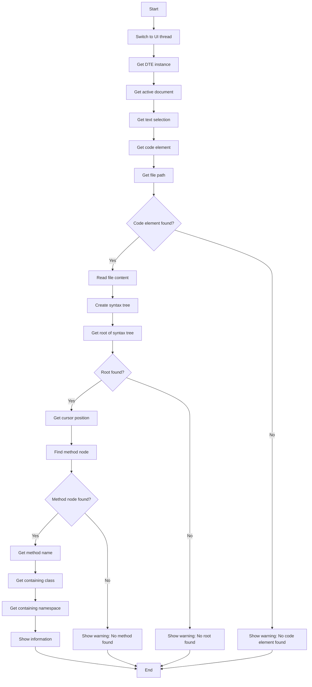
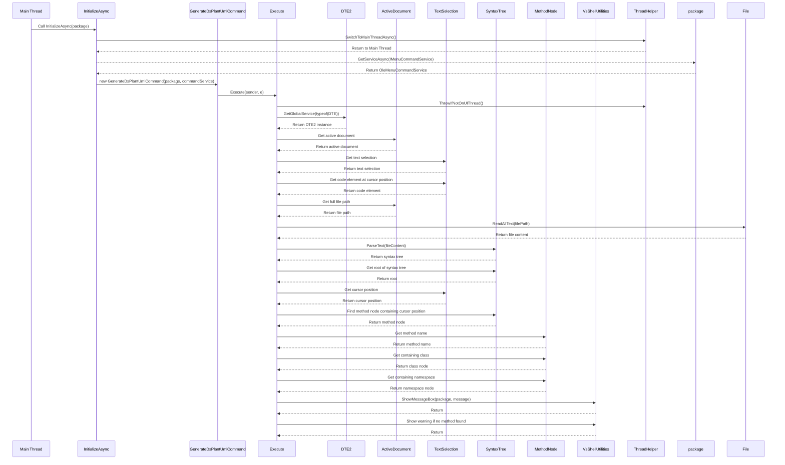

## Method GenerateDsPlantUmlCommand explained
The `Execute` method in the `GenerateDsPlantUmlCommand` class performs the following steps when executed:

1. **Switch to the UI thread**:
 ```csharp
 ThreadHelper.ThrowIfNotOnUIThread();
 ```

2. **Get the DTE instance**:
   
   ```csharp
   var dte = (DTE2)Package.GetGlobalService(typeof(DTE));
   ```

3. **Get the active document**:
   ```charp
   var activeDocument = dte.ActiveDocument;
   ```

4. **Get the text selection in the active document**:
   
   ```csharp
   var textSelection = (TextSelection)
   ```
   
   
5. **Get the code element at the active point of the selection**:
   
   ```csharp
	var codeElement = textSelection.ActivePoint.CodeElement[vsCMElement.vsCMElementFunction];
   ```   
   
6. **Get the full file path**:
   
   ```csharp
   string filePath = activeDocument.FullName;
   ```
   
7. **Check if a code element was found**:
   
   ```csharp
   if (codeElement != null)
   ```
   
8. **Read the file content**:
   
   ```csharp
   var fileContent = File.ReadAllText(filePath);
   ```

9. **Create a syntax tree from the file content**:
   
   ```csahrp
   var syntaxTree = CSharpSyntaxTree.ParseText(fileContent);
   ```

10. **Get the root of the syntax tree**:
    
	   ```csharp
	   var root = syntaxTree.GetRoot() as CompilationUnitSyntax;
	   ```
11. **Check if the root of the syntax tree was found**:
    ```csharp
		if (root == null) 

12. **Get the current cursor position**:
   		```csharp
	 var cursorPosition = textSelection.ActivePoint.AbsoluteCharOffset;
	 ```
	
13. **Find the method node that contains the cursor position**:
    
   ```csharp
   ```var methodNode = root.DescendantNodes() .OfType<MethodDeclarationSyntax>() .FirstOrDefault(m => m.Span.Contains(cursorPosition));
   ```		

14. **Check if a method node was found**:
    
   ```csharp
   if (methodNode != null)
   ```
   
15. **Get the method name**:
    
   ```csharp
   string methodName = methodNode.Identifier.Text;
   `````

16. **Get the containing class**:
    
   ```csharp
   var classNode = methodNode.Ancestors() .OfType<ClassDeclarationSyntax>() .FirstOrDefault(); string className = classNode?.Identifier.Text;
   ```
   
17. **Get the containing namespace**:
    
   ```csharp
   var namespaceNode = classNode?.Ancestors() .OfType<NamespaceDeclarationSyntax>
   ```
   
18. **Show the information**:
    
   ```csharp
   string message = $"Namespace: {namespaceName}\nClass: {className}\nMethod: {methodName}\nFile Path: {filePath}"; VsShellUtilities.ShowMessageBox( this._package, message, "Información del Método Actual", OLEMSGICON.OLEMSGICON_INFO, OLEMSGBUTTON.OLEMSGBUTTON_OK, OLEMSGDEFBUTTON.OLEMSGDEFBUTTON_FIRST);
   ```
   
19. **Handle the case where no method is found at the current cursor position**:
    
   
   ```csharp
   else { VsShellUtilities.ShowMessageBox( this._package, "No se encontró un método en la posición actual del cursor.", "Información del Método Actual", OLEMSGICON.OLEMSGICON_WARNING, OLEMSGBUTTON.OLEMSGBUTTON_OK, OLEMSGDEFBUTTON.OLEMSGDEFBUTTON_FIRST); }

   ```
20. **Handle the case where no code element is found**:
    
   ```csharp
   else { VsShellUtilities.ShowMessageBox( this._package, "No method found at the current cursor position.", "Method Name", OLEMSGICON.OLEMSGICON_WARNING, OLEMSGBUTTON.OLEMSGBUTTON_OK, OLEMSGDEFBUTTON.OLEMSGDEFBUTTON_FIRST); }
   ```
   
Here is a Mermaid diagram to illustrate the flow:



