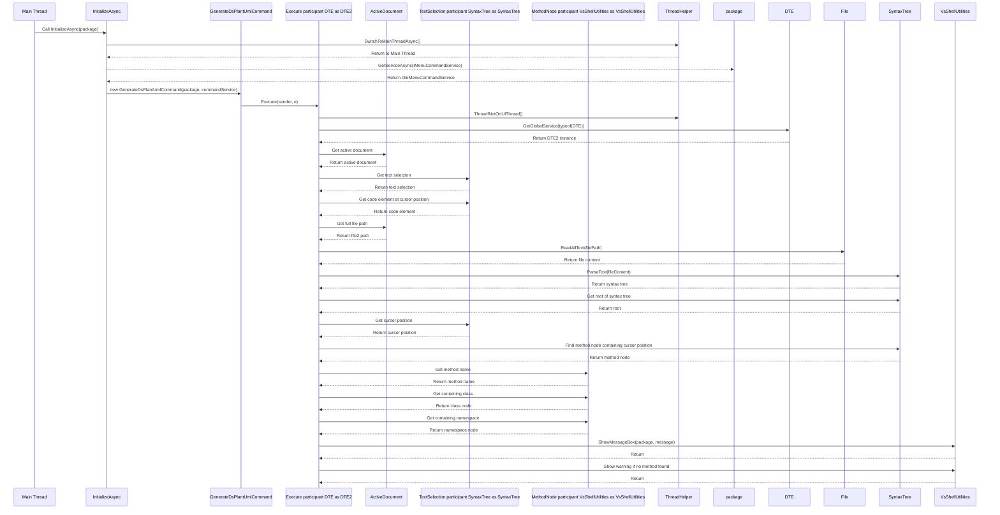

# GenerateDsPlantUmlCommand Execution Flow

This document explains the execution flow of the `GenerateDsPlantUmlCommand` class, which is part of a Visual Studio extension. The class is responsible for displaying information about the method at the current cursor position in the active document.

## Overview

The `GenerateDsPlantUmlCommand` class performs the following steps:

1. **Initialization**: The `InitializeAsync` method sets up the command by registering it with Visual Studio's command service.
2. **Execution**: When the command is invoked, the `Execute` method retrieves the active document, the text selection, and the code element at the cursor position.
3. **Display**: If a method is found at the cursor position, its namespace, class, and method name are displayed in a message box. Otherwise, a warning message is shown.

## Detailed Flow

### 1. Initialization (`InitializeAsync` Method)
- The `InitializeAsync` method is called to initialize the command.
- It switches to the main UI thread using `ThreadHelper.JoinableTaskFactory.SwitchToMainThreadAsync`.
- It retrieves the `OleMenuCommandService` from the package.
- It creates an instance of `GenerateDsPlantUmlCommand` and registers the command with the service.

### 2. Execution (`Execute` Method)
- When the command is executed, the `Execute` method is invoked.
- It ensures the code is running on the UI thread using `ThreadHelper.ThrowIfNotOnUIThread`.
- It retrieves the `DTE2` object, which represents the Visual Studio environment.
- It gets the active document and the current text selection.
- It attempts to retrieve the code element (method) at the cursor position.

### 3. Display Logic
- If a code element (method) is found:
  - The method name, containing class, and namespace are extracted and displayed in a message box using `VsShellUtilities.ShowMessageBox`.
- If no method is found:
  - A warning message is displayed indicating that no method was found at the cursor position.

## Mermaid Diagram

Below is a sequence diagram that visually represents the flow described above:

